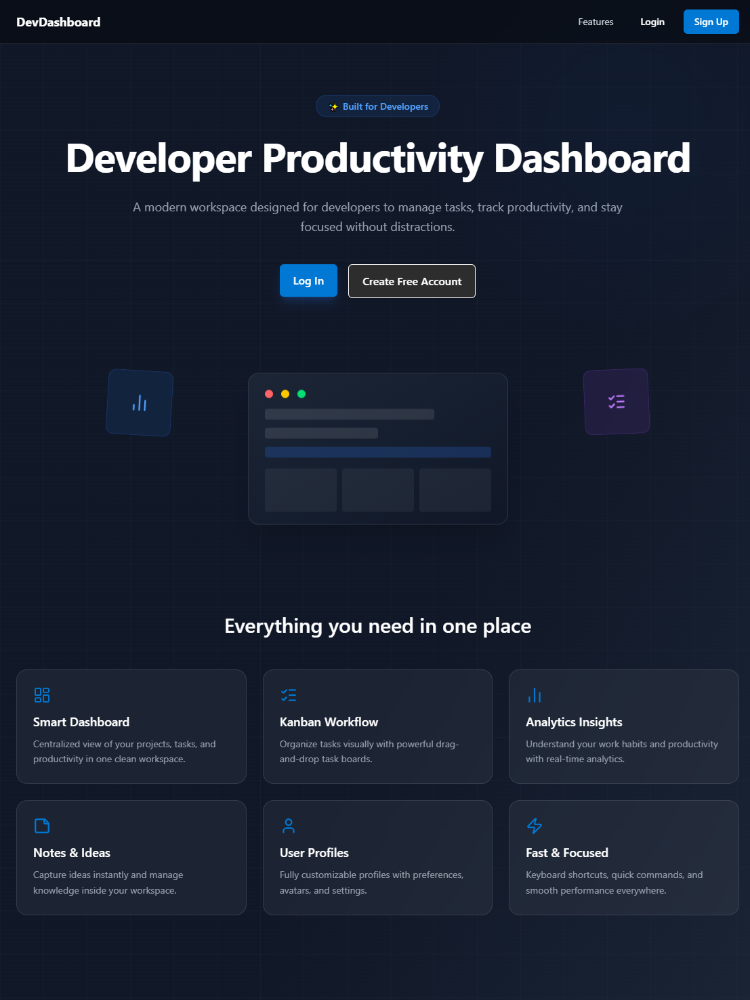
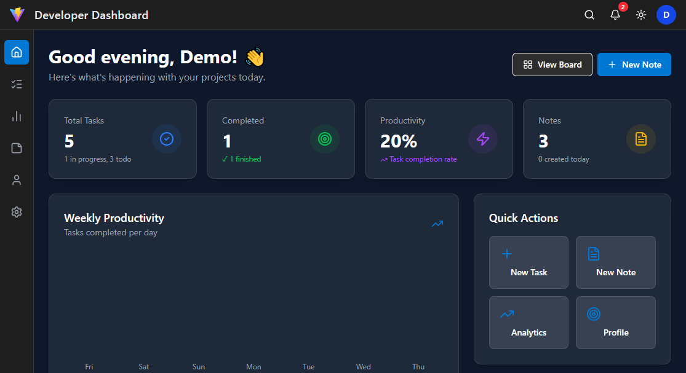
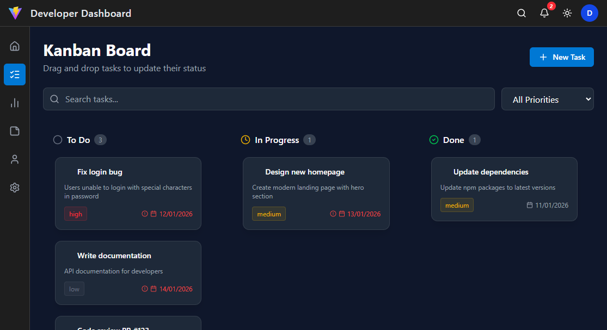
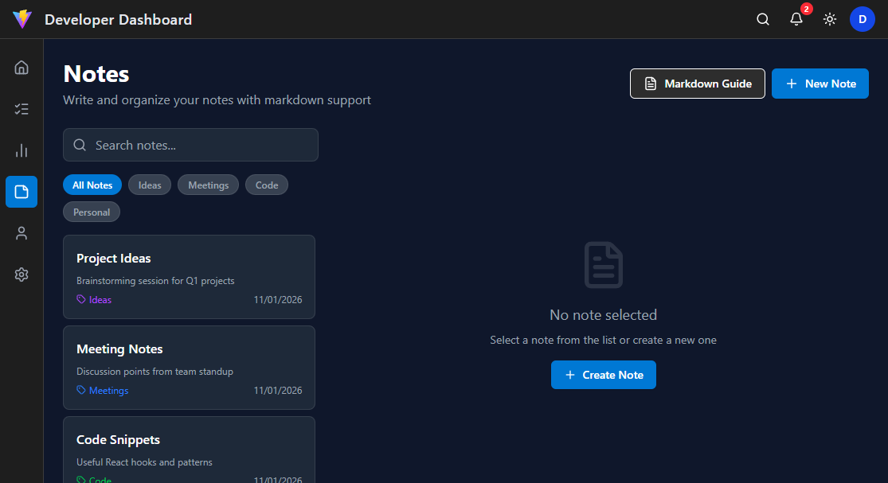
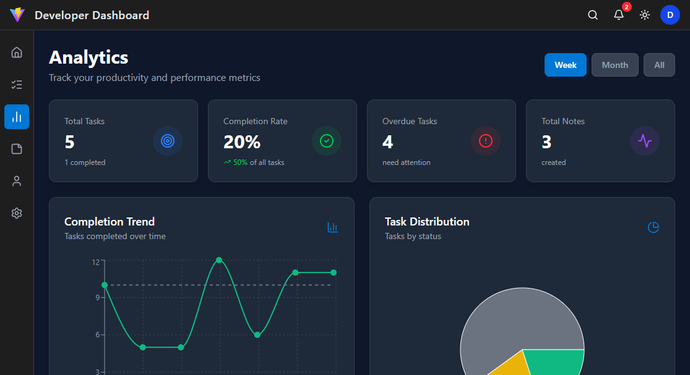
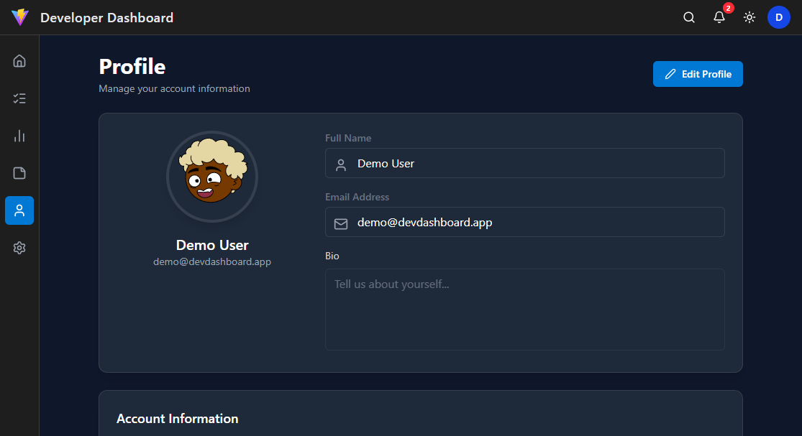
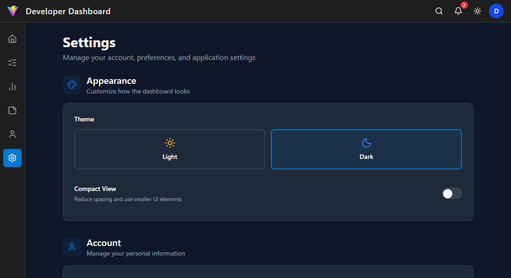

# 🚀 Developer Dashboard

A modern, full-featured productivity dashboard built with React, designed specifically for developers to manage tasks, notes, and track productivity.

[](https://swati-dev-dash.vercel.app/)
[](https://github.com/swati048/dev-dashboard)



**[🚀 View Live Demo](https://swati-dev-dash.vercel.app/)** | **[📖 Documentation](#-features)** | **[💻 Tech Stack](#-tech-stack)**

---

## ✨ Features

### 📊 **Dashboard**
- Real-time productivity metrics and statistics
- Weekly completion trends with interactive charts
- Quick actions for common tasks
- Activity feed showing recent actions

### 📋 **Kanban Board**
- Drag-and-drop task management
- Three-column workflow (To Do, In Progress, Done)
- Priority levels (High, Medium, Low)
- Due date tracking with overdue indicators
- Search and filter functionality

### 📝 **Notes**
- Full markdown support with live preview
- Syntax highlighting for code blocks
- Category organization (Ideas, Meetings, Code, Personal)
- Search across all notes
- Auto-save functionality

### 📈 **Analytics**
- Completion rate tracking
- Priority distribution charts
- Category performance metrics
- Weekly productivity trends
- Key insights and statistics

### ⚙️ **Settings**
- Dark/Light theme toggle
- Account management
- Notification preferences
- Data export/import (JSON)
- Keyboard shortcuts

### 👤 **Profile**
- User information management
- Avatar customization (8 styles)
- Activity statistics
- Bio and preferences

---

## 🛠️ Tech Stack

### Frontend
- **Framework:** React 18 with Vite
- **Routing:** React Router v6
- **State Management:** Zustand (lightweight, no boilerplate)
- **Styling:** Tailwind CSS v4 (utility-first)
- **Animations:** Framer Motion (smooth, performant)

### Features
- **Charts:** Recharts (responsive, customizable)
- **Markdown:** React Markdown + remark-gfm
- **Syntax Highlighting:** rehype-highlight
- **Icons:** Lucide React (tree-shakeable)
- **Drag & Drop:** Native HTML5 DnD API (no dependencies)

### Development
- **Build Tool:** Vite (fast HMR, optimized builds)
- **Package Manager:** npm
- **Deployment:** Vercel (auto-deploy from GitHub)

---

## 🚀 Getting Started

### Prerequisites
- Node.js 18+ and npm

### Installation

1. **Clone the repository**
```bash
git clone https://github.com/swati048/dev-dashboard.git
cd dev-dashboard
```

2. **Install dependencies**
```bash
npm install
```

3. **Start development server**
```bash
npm run dev
```

4. **Open in browser**
```
http://localhost:5173
```

### Build for Production
```bash
npm run build
npm run preview
```

---

## 🎮 Try It Out

**No signup required!** Click the "Try Demo Account" button on the login page to explore all features with pre-populated data.

Demo Features:
- ✅ Pre-loaded tasks and notes
- ✅ Interactive Kanban board
- ✅ Full analytics dashboard
- ✅ All features unlocked

---

## 🎨 Features Showcase

### Theme System
- Fully functional dark/light mode
- Persistent theme selection
- Smooth transitions

### Data Persistence
- All data stored in browser's localStorage
- Export/Import functionality
- No backend required
- Privacy-focused (data never leaves your device)

### Keyboard Shortcuts
- `Ctrl + K` - Open command palette
- `Esc` - Close modals

### Responsive Design
- Mobile-first approach
- Works on all screen sizes
- Touch-friendly interface
- Optimized for tablets

---

## 📸 Screenshots

### Home Page


### Dashboard


### Kanban Board


### Notes


### Analytics


### Profile


### Settings


---

## 🎯 Project Structure
```
src/
├── components/        # Reusable UI components
│   ├── ui/           # Base UI components (Button, Input, Card, Modal)
│   └── ...           # Feature components
├── layouts/          # Layout components (AppLayout, Sidebar, Topbar)
├── pages/            # Route pages
│   ├── Dashboard.jsx
│   ├── Kanban.jsx
│   ├── Notes.jsx
│   ├── Analytics.jsx
│   ├── Profile.jsx
│   └── Settings.jsx
├── store/            # Zustand stores
│   ├── useAuthStore.js
│   ├── useTaskStore.js
│   ├── useNotesStore.js
│   ├── useActivityStore.js
│   └── useProductivityStore.js
├── utils/            # Utility functions
│   ├── cn.js         # Class name utility
│   └── toast.js      # Toast notifications
├── router.jsx        # Route configuration
└── main.jsx         # App entry point
```

---

## 💡 Why This Project?

This project demonstrates:
- ✅ **Modern React Patterns** - Hooks, context, custom hooks
- ✅ **State Management** - Zustand for global state
- ✅ **Component Architecture** - Reusable, composable components
- ✅ **Performance Optimization** - Code splitting, lazy loading
- ✅ **User Experience** - Smooth animations, loading states, error handling
- ✅ **Responsive Design** - Mobile-first, works on all devices
- ✅ **Accessibility** - Keyboard navigation, ARIA labels
- ✅ **Clean Code** - Consistent formatting, readable structure

---

## 🌟 Highlights

- **No Backend Required** - Fully client-side application
- **Local-First** - All data stored locally
- **Privacy-Focused** - Your data never leaves your device
- **Modern Stack** - Latest React patterns and best practices
- **Production Ready** - Optimized build with code splitting
- **Accessible** - ARIA labels and keyboard navigation
- **Fast** - Vite for lightning-fast HMR

---

## 🤝 Contributing

This is a portfolio project, but suggestions and feedback are welcome!

---

## 📄 License

MIT License - feel free to use this project for learning and inspiration.

---

## 👨‍💻 Author

**Swati Thakur**
- GitHub: [@swati048](https://github.com/swati048)
- LinkedIn: [Swati Thakur](https://linkedin.com/in/swati048)
- Email: thakurswati048@gmail.com

---

## 🙏 Acknowledgments

- Icons by [Lucide](https://lucide.dev)
- Avatars by [DiceBear](https://dicebear.com)
- Charts by [Recharts](https://recharts.org)
- Animations by [Framer Motion](https://www.framer.com/motion)

---

<div align="center">

⭐ **If you found this project helpful, please give it a star!** ⭐

Made with ❤️ by Swati Thakur

</div>